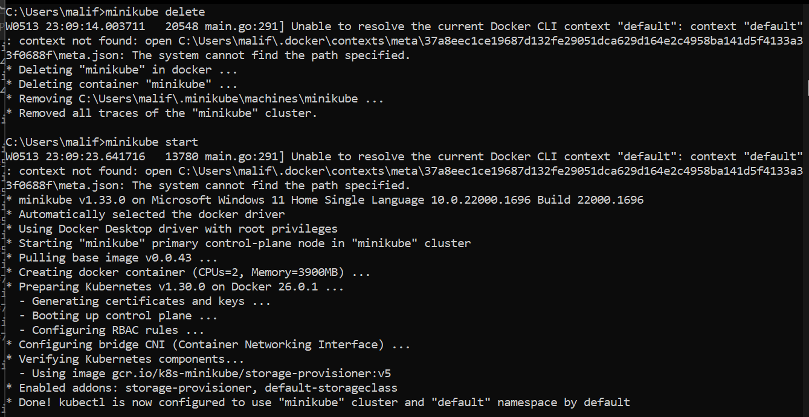
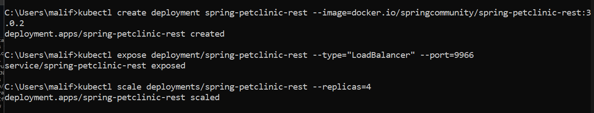
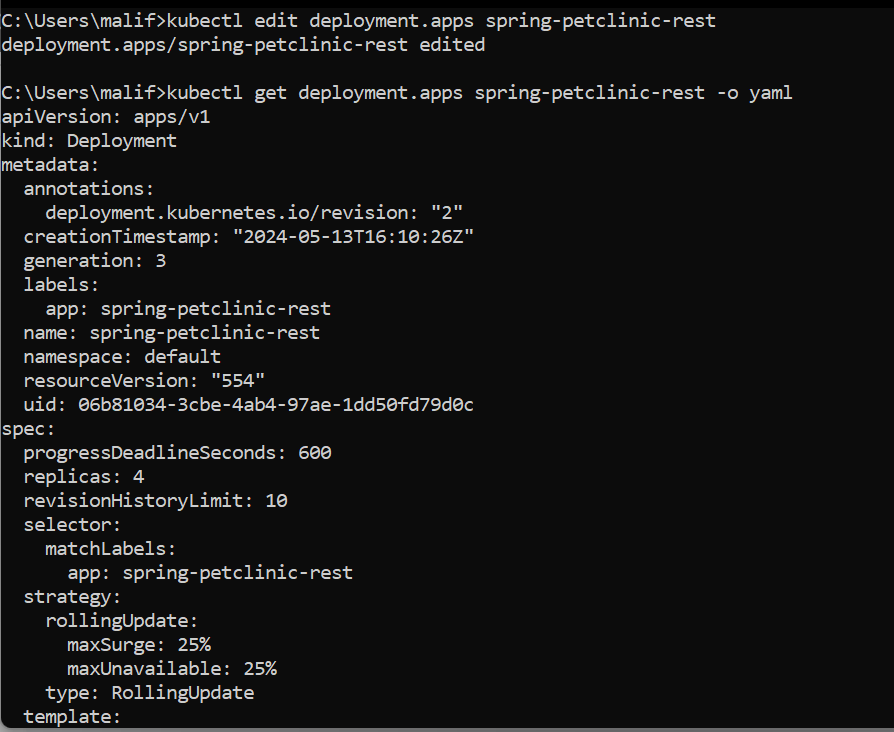
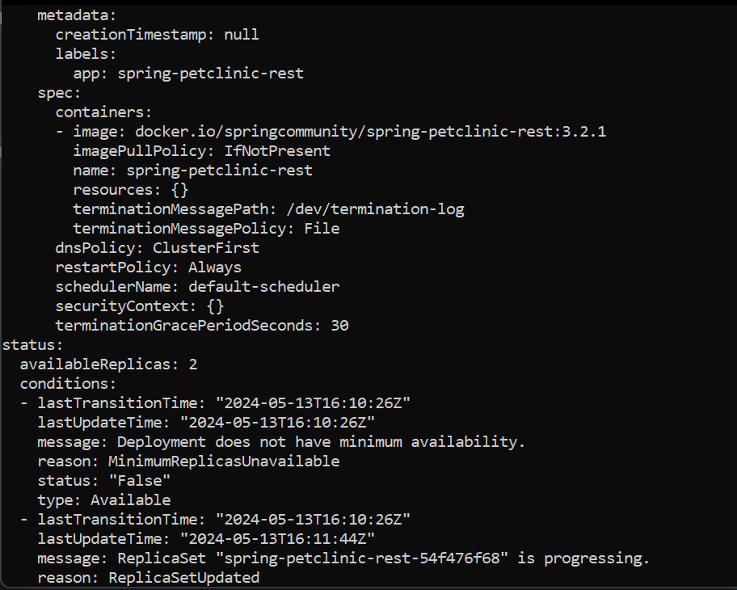
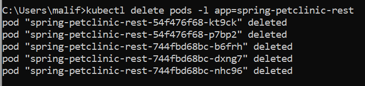
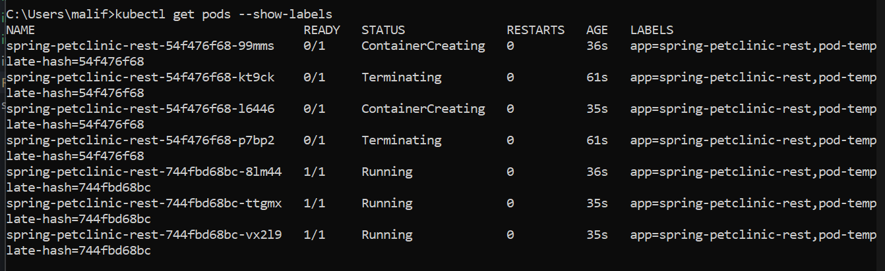
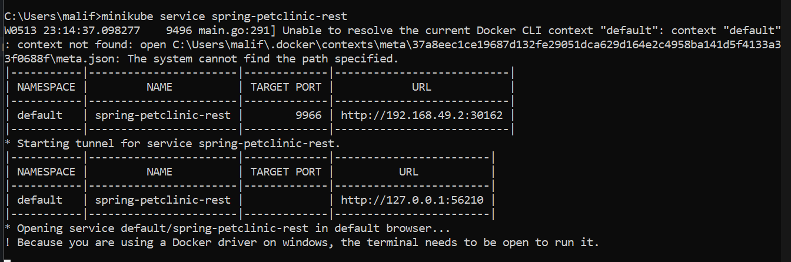
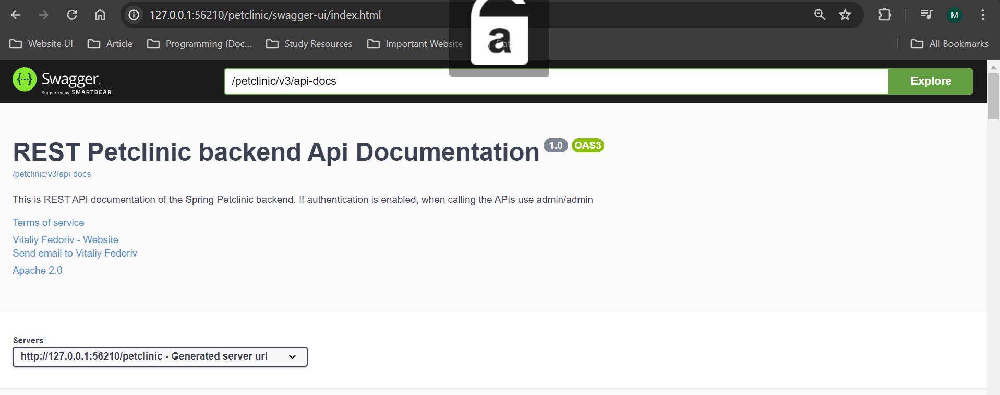
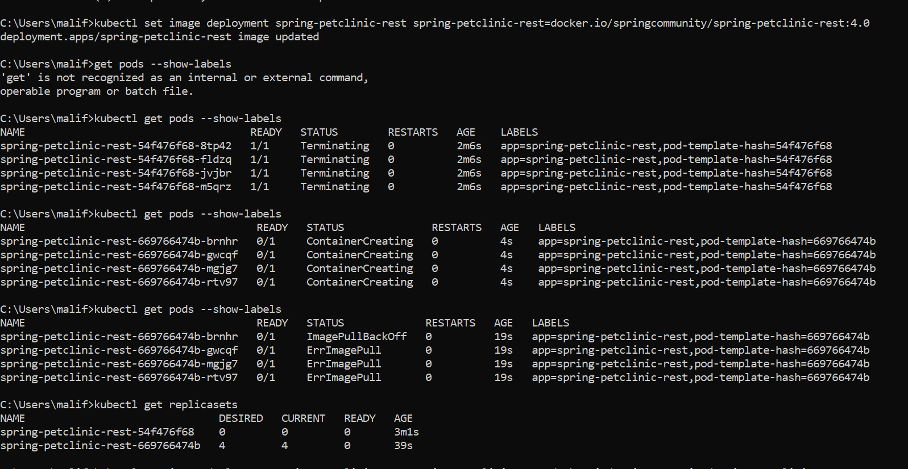
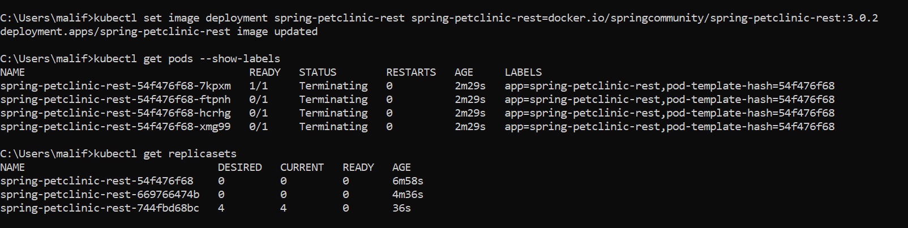

## Hello Minikube

1.Compare the application logs before and after you exposed it as a Service.Try to open the app several times while the proxy into the Service is running.What do you see in the logs? Does the number of logs increase each time you open the app?

> 
> Setelah Pod di-_expose_ sebagai Service, Pod bisa diakses oleh _external clients_. Terlihat pada gambar log diatas, aplikasi dapat menerima request yang dikirimkan oleh browser ketika aplikasi dibuka. Semakin sering aplikasi dibuka, banyak log request yang diterima juga semakin banyak.

2.Notice that there are two versions of `kubectl get` invocation during this tutorial section.The first does not have any option, while the latter has `-n` option with value set to
`kube-system`.
What is the purpose of the `-n` option and why did the output not list the pods/services that you
explicitly created.

> Opsi `-n` dalam perintah `kubectl get` digunakan untuk menentukan tempat pod atau service berada. Setiap namespace memiliki pod dan service yang berbeda-beda. Opsi `-n kube-system` hanya akan menampilkan pod atau service pada name space `kube-system` saja sehingga pod atau service yang kita buat tidak termasuk kedalamanya.

## Rolling Update & Kubernetes Manifest File

1. What is the difference between Rolling Update and Recreate deployment strategy?

   > Rolling update adalah strategi yang memungkinkan kita untuk memperbarui sekumpulan pod tanpa downtime. Strategi ini menggantikan pod yang menjalankan versi lama dari aplikasi dengan versi baru, satu per satu. Rolling Update memastikan transisi yang lancar dan terus menerus, mengurangi downtime dengan menjaga sejumlah instance sepanjang proses pembaruan. Sementara itu, strategi Recreate terdiri dari mematikan versi A kemudian menerapkan versi B setelah versi A dimatikan. Saat transisi, ada momen downtime singkat yang memungkinkan versi yang diperbarui untuk mengambil tempatnya.

2.Try deploying the Spring Petclinic REST using Recreate deployment strategy and document
your attempt.

> - Mempersiapkan cluster minikube baru
>   
> - Membuat deployment dan services baru dari Spring Petclinic REST serta melakukan scaling.
>   
> - Edit template replicaset
>    
> - Hapus semua _running_ pods
>   
> - Replicaset membuat pod baru dengan image yang telah diupdate.
>   
> - Tes run app
>    

3. Prepare different manifest files for executing Recreate deployment strategy.

   > Dapat dilihat pada file `deployment-recreate.yaml`. Perbedaan dengan manifest file yang dihasilkan tutorial sebelumnya terletak pada

   ```
   selector:
   matchLabels:
     app: spring-petclinic-rest
   strategy:
   type: Recreate
   ```

   >  
   > Terlihat melalui gambar diatas, setiap dilakukan update image. Pod yang lama dimatikan terlebih dahulu sebelum pod baru dibuat.

4.What do you think are the benefits of using Kubernetes manifest files? Recall your experience
in deploying the app manually and compare it to your experience when deploying the same app
by applying the manifest files (i.e., invoking `kubectl apply -f` command) to the cluster.

> Menurut saya, penggunaan manifest files sangat membantu dalam memastikan konsistensi dalam melakukan deployment. File manifest memastikan aplikasi di-deploy dengan cara yang sama sehingga mengurangi risiko kesalahan manusia. Selain itu, penggunaan manifest files juga membantu dalam mengautomasi proses deployment sehingga lebih cepat.
