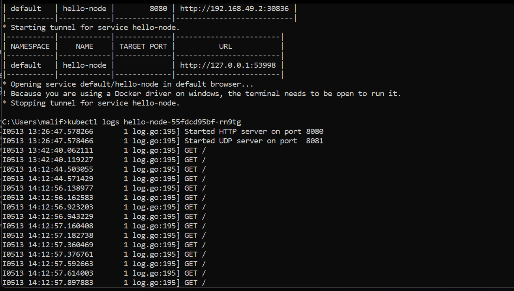

## Hello Minikube

1.Compare the application logs before and after you exposed it as a Service.Try to open the app several times while the proxy into the Service is running.What do you see in the logs? Does the number of logs increase each time you open the app?

> 
> Setelah Pod di-_expose_ sebagai Service, Pod bisa diakses oleh _external clients_. Terlihat pada gambar log diatas, aplikasi dapat menerima request yang dikirimkan oleh browser ketika aplikasi dibuka. Semakin sering aplikasi dibuka, banyak log request yang diterima juga semakin banyak.

2.Notice that there are two versions of `kubectl get` invocation during this tutorial section.The first does not have any option, while the latter has `-n` option with value set to
`kube-system`.
What is the purpose of the `-n` option and why did the output not list the pods/services that you
explicitly created.

> Opsi `-n` dalam perintah `kubectl get` digunakan untuk menentukan tempat pod atau service berada. Setiap namespace memiliki pod dan service yang berbeda-beda. Opsi `-n kube-system` hanya akan menampilkan pod atau service pada name space `kube-system` saja sehingga pod atau service yang kita buat tidak termasuk kedalamanya.
